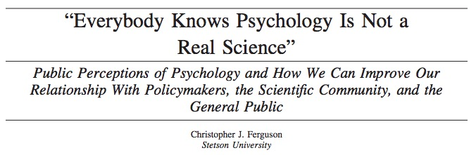

The Whole Elephant
================
Rick O. Gilmore
2017-04-10 11:47:32

------------------------------------------------------------------------


The proverbial blind men studying the elephant from Hindu mythology.

Truth
=====

Psychology is harder than physics
---------------------------------


Psychology is harder than physics
---------------------------------


Behavior has multiple, nested dimensions
----------------------------------------

<video width="600" height="400" controls>
<source src="https://nyu.databrary.org/slot/11652/307774,376273/asset/47075/download?inline=true" type="video/mp4"> Your browser does not support the video tag.
</video>

Adolph, K., Tamis-LeMonda, C. & Gilmore, R.O. (2016). PLAY Project: Webinar discussions on protocol and coding. Databrary. Retrieved February 17, 2017 from <https://nyu.databrary.org/volume/232>

Most (interesting) psychological problems...
--------------------------------------------


<!-- Scrolling page -->
<!-- http://stackoverflow.com/q/38260799 -->
<style>
slides > slide { overflow: scroll; }
slides > slide:not(.nobackground):before {
  background: none;
  }
slides > slide:not(.nobackground):after {
  content: '';
  background: none;
  }
}
</style>
Span multiple levels
--------------------


Shonkoff, J. P., & Phillips, D. A. (Eds.). (2000). From neurons to neighborhoods: The science of early childhood development. National Academies Press.

From neurons to neighborhoods.

Change across time
------------------


So do most (non-trivial) brain systems
--------------------------------------


And most interesting or realistic brain systems are densely interconnected networks of elements.

------------------------------------------------------------------------

<iframe src="http://www.developingconnectome.org/">
</iframe>
Developing human connectome project.

------------------------------------------------------------------------


<https://www.ndcn.ox.ac.uk/news/new-oxford-neurodevelopment-consortium>

Estimating components of these networks requires
------------------------------------------------

-   Multiple variables
-   Large samples
    -   Larger than most researchers collect
    -   Or single studies can afford to collect
-   Broad/diverse samples

Most studies are underpowered
-----------------------------

-   Maxwell, S. E. (2004). The Persistence of Underpowered Studies in Psychological Research: Causes, Consequences, and Remedies. *Psychological Methods*, 9(2), 147–163. <https://doi.org/10.1037/1082-989X.9.2.147>
-   Ioannidis, J. P. A. (2005). Why Most Published Research Findings Are False. *PLOS Medicine*, 2(8), e124. <https://doi.org/10.1371/journal.pmed.0020124>

[(Szucs and Ioannidis 2016)](http://doi.org/10.1101/071530)
-----------------------------------------------------------

"We have empirically assessed the distribution of published effect sizes and estimated power by extracting more than 100,000 statistical records from about 10,000 cognitive neuroscience and psychology papers published during the past 5 years. The reported median effect size was d=0.93 (inter-quartile range: 0.64-1.46) for nominally statistically significant results and d=0.24 (0.11-0.42) for non-significant results. <span class="red">Median power to detect small, medium and large effects was 0.12, 0.44 and 0.73</span>, reflecting no improvement through the past half-century. Power was lowest for cognitive neuroscience journals. 14% of papers reported some statistically significant results, although the respective F statistic and degrees of freedom proved that these were non-significant; <span class="red">p value errors positively correlated with journal impact factors. False report probability is likely to exceed 50% for the whole literature</span>. In light of our findings the recently reported low replication success in psychology is realistic and worse performance may be expected for cognitive neuroscience."

We don't have good intuitions about sample sizes & power
--------------------------------------------------------


[(Bakker et al. 2016)](http://dx.doi.org/10.1177/0956797616647519)

As this figure from Bakker et al. 2016 shows, researchers *underestimate* the power of large sample studies and overestimate the power of small sample ones.

Our samples are WEIRD
---------------------

-   Much (lab-based) data collected are from **W**estern, **E**ducated **I**ndustrialized, **R**ich, **D**emocratic (WEIRD) populations [(Henrich, Heine, and Norenzayan 2010)](http://doi.org/10.1017/S0140525X0999152X)
-   Even on [Mechanical Turk](http://www.behind-the-enemy-lines.com/2015/04/demographics-of-mechanical-turk-now.html)

------------------------------------------------------------------------


See also: <http://demographics.mturk-tracker.com/>

and Consequences
================

------------------------------------------------------------------------


We can acknowledge the elephant in the room -- the limitations to reliability and validity in our field.

Many threats to our science...
------------------------------

-   Fraud
-   Misconduct
-   Questionable practices
-   Reproducibility
-   Limited data, materials sharing
-   Fractionation, fragmentation, siloing

Fraud
-----

-   [Diederik Stapel](http://www.nytimes.com/2013/04/28/magazine/diederik-stapels-audacious-academic-fraud.html?pagewanted=all&_r=0)
    -   [Commentary](http://root.bryancavemedia.com/marketing/downloads/schooled_in_fraud_compliance_lessons_from_lying_dutchman_killingsworth.pdf)
-   [Michael LaCour](http://www.nature.com/news/political-science-s-problem-with-research-ethics-1.17866)
    -   Broockman, D., Kalla, J., Aronow, P. (2015, May 19). Irregularities in LaCour (2014). Retrieved February 16, 2017 from <http://stanford.edu/~dbroock/broockman_kalla_aronow_lg_irregularities.pdf>

Michael LaCour
--------------

<a href="http://science.sciencemag.org/content/348/6239/1100.2">  </a>

<!-- ## Diederik Stapel -->
<!-- - Dean of the School of Social and Behavioral Sciences at Tilburg University -->
<!-- - Teacher of Scientific Ethics course -->
<!-- - Fraud investigation launched when 3 grad students noticed anomalies -- duplicate entries in data tables -->
<!-- - Stapel confessed, lost position, gave up Ph.D., wrote a book -->
<!-- - Details in [Flawed science: The fraudulent research practices of social psychologist Diederik Stapel](http://pubman.mpdl.mpg.de/pubman/item/escidoc:1569964:8/component/escidoc:1569966/Stapel_Investigation_Final_report.pdf) -->
<!-- [[@fanelli_how_2009]](https://doi.org/10.1371/journal.pone.0005738) -->
Misconduct
----------

-   [Marc Hauser](http://www.sciencemag.org/news/2012/09/harvard-psychology-researcher-committed-fraud-us-investigation-concludes)
    -   <http://www.sciencemag.org/news/2014/05/harvard-misconduct-investigation-psychologist-released>
    -   [2012 report by NIH Office of Research Integrity (ORI)](https://grants.nih.gov/grants/guide/notice-files/NOT-OD-12-149.html)
    -   [Hauser's response](http://archive.boston.com/whitecoatnotes/2012/09/05/marc-hauser-responds-federal-finding-scientific-misconduct/spzRWEVIPKA4BUu8wi8t8J/story.html)

Questionable practices
----------------------

-   Brian Wansink, Cornell Food & Brand Lab
    -   <http://nymag.com/scienceofus/2017/02/cornells-food-and-brand-lab-has-a-major-problem.html>
    -   <http://nymag.com/scienceofus/2017/03/cornell-food-brand-lab-problems.html>
    -   [(Zee, Anaya, and Brown 2017)](https://peerj.com/preprints/2748)

Self-reported data fabrication, falsification, and alteration
-------------------------------------------------------------

<a href="http://journals.plos.org/plosone/article?id=10.1371/journal.pone.0005738">  </a>

[(Fanelli 2009)](https://doi.org/10.1371/journal.pone.0005738)

Self-reports of questionable research practices
-----------------------------------------------

<a href="http://journals.plos.org/plosone/article?id=10.1371/journal.pone.0005738">  </a>

[(Fanelli 2009)](https://doi.org/10.1371/journal.pone.0005738)

Mistakes, e.g., flexible "stopping" rules
-----------------------------------------

<a href="">  </a>

[(Simmons, Nelson, and Simonsohn 2011)](http://doi.org/10.1177/0956797611417632)

Errors/omissions in data
------------------------

-   C. Reinhart and K. Rogoff paper, <http://www.nber.org/papers/w15639.pdf?new_window=1>
    -   Omitted data in Excel spreadsheet used to model effect of public debt on econcomic growth. <https://www.bloomberg.com/news/articles/2013-04-18/faq-reinhart-rogoff-and-the-excel-error-that-changed-history>
    -   Error only found when data were shared.

Reproducibility "crisis"
------------------------

-   [Reproducibility Project: Psychology](https://osf.io/ezcuj/)
-   Attempt to replicate 100 experimental and correlational studies published in three psychology journals in 2008 using high-powered designs and original materials when available [(Collaboration 2015)](http://doi.org/10.1126/science.aac4716)
-   39/98 (39.7%) replication attempts were successful
-   97% of original studies reported statistically significant results vs. 36% of replications

------------------------------------------------------------------------


[(Collaboration 2015)](http://doi.org/10.1126/science.aac4716)

Many Labs project
-----------------


[Many Labs project](https://osf.io/wx7ck/wiki/home/)

Not just social & behavioral science
------------------------------------

-   [Carlo Croce @ Ohio State](https://www.nytimes.com/2017/03/08/science/cancer-carlo-croce.html)
-   [Reproducibility initiative in cancer biology](http://blogs.nature.com/news/2013/10/initiative-gets-1-3-million-to-verify-findings-of-50-high-profile-cancer-papers.html).
    -   [Details on OSF](https://osf.io/e81xl/)
-   Significant concerns about reproducibility of biomedical science findings have been raised: [(Begley and Ellis 2012)](http://doi.org/10.1038/483531a) and [(Prinz, Schlange, and Asadullah 2011)](http://doi.org/10.1038/nrd3439-c1)

------------------------------------------------------------------------

<iframe src="http://www.nature.com/news/cancer-reproducibility-project-releases-first-results-1.21304">
</iframe>
Is there a reproducibility crisis or not?
-----------------------------------------

<a href="http://www.nature.com/polopoly_fs/7.36716.1469695923!/image/reproducibility-graphic-online1.jpeg_gen/derivatives/landscape_630/reproducibility-graphic-online1.jpeg" height=450px>  </a>

[(Baker 2016)](http://doi.org/10.1038/533452a)

Results from a survey of 1,500 scientists by Nature in 2016.

------------------------------------------------------------------------

<a href="http://www.nature.com/polopoly_fs/7.36718.1464174471!/image/reproducibility-graphic-online3.jpg_gen/derivatives/landscape_630/reproducibility-graphic-online3.jpg">  </a>

[(Baker 2016)](http://doi.org/10.1038/533452a)

Results from a survey of 1,500 scientists by Nature in 2016.

------------------------------------------------------------------------

<a href="http://www.nature.com/polopoly_fs/7.36719.1464174488!/image/reproducibility-graphic-online4.jpg_gen/derivatives/landscape_630/reproducibility-graphic-online4.jpg">  </a>

[(Baker 2016)](http://doi.org/10.1038/533452a)

Results from a survey of 1,500 scientists by Nature in 2016.

Lack of clarity/agreement about reproducibility
-----------------------------------------------

-   What does it mean to evaluate reproducibility across a field or subfield?
-   Are we clear about what 'reproducibility' means? [(Goodman, Fanelli, and Ioannidis 2016)](http://doi.org/10.1126/scitranslmed.aaf5027)

The downside of specialization
------------------------------


Image of silos. But, not only are the data sources vertically siloed. Much of academic research operates in disciplinary, journal, or departmental silos that may or may not fit the full scope of a phenomenon.

------------------------------------------------------------------------


And so it may often seem like we are the proverbial blind men studying the elephant from Hindu mythology.

What's at stake?
----------------

> -   A great deal
> -   Validity of our evidence
> -   Credibility of our arguments

------------------------------------------------------------------------



[(Ferguson 2015)](http://doi.org/10.1037/a0039405)

------------------------------------------------------------------------


In our defense...
-----------------

-   Science is hard
-   Life is short
-   Funding is competitive
-   Incentive structure undermines transparency, openness, sharing

------------------------------------------------------------------------


[(Higginson and Munafò 2016)](http://10.1371/journal.pbio.2000995)

Small-scale solutions
=====================

New 'big data' data sources
---------------------------

-   Wearables
-   Electronic education records
-   Electronic medical records
-   Social media

------------------------------------------------------------------------


Google and Facebook.

Big data studies
----------------

-   [Human Connectome Project](http://www.humanconnectomeproject.org/), [Baby Connectome Project](https://fnih.org/what-we-do/current-research-programs/baby-connectome), [Developing Human Connectome Project](http://www.developingconnectome.org/)
-   [Add Health](http://www.cpc.unc.edu/projects/addhealth), [Early Childhood Longitudinal Study (ECLS)](https://nces.ed.gov/ecls/), [National Longitudinal Survey of Youth (NLSY)](https://www.nlsinfo.org/content/cohorts/nlsy79)
-   But, [National Children's Study (NCS)](https://www.nichd.nih.gov/research/NCS/Pages/default.aspx), [British Life Study](http://www.nature.com/news/massive-uk-baby-study-cancelled-1.18650)
-   [Environmental Influences on Child Health Outcomes (ECHO)](https://www.nih.gov/echo)

There are many examples of large scale studies in social and behavioral science. Have seeded entire subfields. But, expensive, contrain the questions, privilege data collectors, and may or may not be openly shared.

Large-scale studies
-------------------

-   Expensive to mount, maintain
-   Limited in scope
-   Magnets for scholarship, but what about lab-based, individual investigator initiated?

Emerging ideals and avenues for data sharing
--------------------------------------------

-   **F**indable, **A**ccessible, **I**nteroperable, and **R**euseable ([FAIR Data Principles](https://www.force11.org/group/fairgroup/fairprinciples)).
-   [Published](https://en.wikipedia.org/wiki/Data_publishing#Paper) alongside articles or in data journals, e.g. [Nature Scientific Data](http://www.nature.com/sdata/).
    -   Full disclosure: Gilmore on editorial board

Many options
------------

-   Data repositories
    -   [Open Science Framework (OSF)](https://osf.io/)
    -   [Inter-university Consortium for Political and Social Research (ICPSR)](http://www.icpsr.umich.edu)
    -   [Dataverse](http://dataverse.org)
    -   [Dryad Data Repository](http://datadryad.org)
    -   [Databrary](http://databrary.org)

But, data sharing limited
-------------------------


Wicherts, J. M., Borsboom, D., Kats, J., & Molenaar, D. (2006). The poor availability of psychological research data for reanalysis. American Psychologist, 61(7), 726–728. <https://doi.org/10.1037/0003-066X.61.7.726>

And, little improvement over time...
------------------------------------


[(Vanpaemel et al. 2015)](http://doi.org/10.1525/collabra.13)

*American Psychologist*, *70*(6), Sept 2015

------------------------------------------------------------------------

<a href="http://www.nature.com/polopoly_fs/7.36727.1464174506!/image/reproducibility-graphic-online5.jpg_gen/derivatives/landscape_630/reproducibility-graphic-online5.jpg">  </a>

[(Baker 2016)](http://doi.org/10.1038/533452a)

Going back to the results from that survey of 1,500 scientists by Nature in 2016.

Changing journal, funder practices
----------------------------------

-   [Transparency and opennness promotion (TOP) guidelines](https://osf.io/9f6gx/)
-   [(B. A. Nosek et al. 2015)](http://doi.org/10.1126/science.aab2374)

------------------------------------------------------------------------

-   Citation
-   Data transparency
-   Analytic methods (code) transparency
-   Design and analysis transparency
-   Preregistration of studies
-   Preregistration of analysis plans
-   Replication

[(Munafò et al. 2017)](http://doi.org/10.1038/s41562-016-0021) manifesto
------------------------------------------------------------------------

<a href="http://www.nature.com/articles/s41562-016-0021/figures/1">  </a>

Improving methodology training
------------------------------

-   [Literate Programming](http://www.literateprogramming.com/)
    -   [RStudio](http://rstudio.com) and [R Markdown](http://rmarkdown.rstudio.com/)
    -   [Jupyter](http://jupyter.org) notebooks
    -   Electronic lab notebooks, talks, reports, articles...
-   [Software Carpentry](https://software-carpentry.org/)
-   Version control (e.g., GitHub)

Meta-analysis/systematic reviews an important tool
--------------------------------------------------

-   "Cochrane reviews" for psychological science?
-   <https://www.youtube.com/embed/egJlW4vkb1Y>
-   But, challenges in reproducing meta-analyses [(Lakens, Hilgard, and Staaks 2016)](http://dx.doi.org/10.1186/s40359-016-0126-3)

New techniques
--------------

-   Sequential Bayes Factors and related techniques [(Wagenmakers, Morey, and Lee 2016)](http://dx.doi.org/10.1177/0963721416643289)
-   Dienes, Z. (2008). Understanding Psychology as a Science: An Introduction to Scientific and Statistical Inference. <http://www.lifesci.sussex.ac.uk/home/Zoltan_Dienes/inference/>

Replication studies, pre-registration, registered reports
---------------------------------------------------------

-   What studies to replicate?
-   Who pays?
-   Scholarly value, reputation

Scholarly society initiatives
-----------------------------

-   ICIS
    -   Recently adopted registered reports format
-   SRCD
    -   Considering task force
-   [Society for the Improvement of Psychological Science (SIPS)](http://improvingpsych.org/)

REALLY BIG solutions
====================

Thinking big...
---------------


The space reference is apt. I think there might be something we can learn from other big data science projects like the Hubble Space Telescope.

------------------------------------------------------------------------

<a href="https://en.wikipedia.org/wiki/Hubble_Ultra-Deep_Field">  </a>

The Hubble Ultra Deep Field. Taken over 3.5 months in 2003-04. Contains an estimated 10,000 galaxies, and because time and space collapse at astronomical distances, looks back ~13 billion years, or 400-800 years before the big bang.

------------------------------------------------------------------------


Or, the Large Hadron Collider.

------------------------------------------------------------------------


Cover of Nature issue in 2003 with the release of a 99% complete draft of the human genome.

------------------------------------------------------------------------


(Cartoon of human genome). "When I asked what little girls were made of, I was hoping we would say sugar and spice."

------------------------------------------------------------------------


Human Connectome Project image.

------------------------------------------------------------------------

<a href="https://www.neuroscienceblueprint.nih.gov/connectome/">  </a>

Connectivity matrix from human connectome project data.

Imagine a 'Databservatory' for human behavior
---------------------------------------------


Imagine a Human Behaviorome
---------------------------


Shonkoff, J. P., & Phillips, D. A. (Eds.). (2000). From neurons to neighborhoods: The science of early childhood development. National Academies Press.

From neurons to neighborhoods.

------------------------------------------------------------------------


------------------------------------------------------------------------


------------------------------------------------------------------------


Even with the domain of neuroscience, we recognize that the phenomena we seek to understand operate across multiple spatial and temporal scales.

------------------------------------------------------------------------

 </a>

And that no single method we use operates across the spatial and temporal scales of the phenomena we want to understand.

What would this micro/macro/telescope look like?
------------------------------------------------

> -   Recruiting -- larger, more diverse samples
> -   Data collection -- more data types, allow linkage across levels
> -   Data curation/management -- easy/automatic, standardized formats
> -   Data sharing -- PI controls when, permission levels

------------------------------------------------------------------------

> -   Data mining, visualization, linking
> -   Search, filter by participant characteristics, tasks/measures, geo/temporal factors
> -   Analysis in the "cloud"
> -   Automatic versioning, history

------------------------------------------------------------------------


------------------------------------------------------------------------


------------------------------------------------------------------------


------------------------------------------------------------------------


------------------------------------------------------------------------

<a href="https://autismandbeyond.researchkit.duke.edu/">  </a>

------------------------------------------------------------------------

<a href="https://www.mturk.com">  </a>

------------------------------------------------------------------------


------------------------------------------------------------------------

<a href="https://lookit.mit.edu/">  </a>

------------------------------------------------------------------------


The front end
-------------

> -   App/web service
> -   Linking researchers with participants (**mesear.ch**), and parents (**babym.io**)
> -   Participants own/control their data, determine level of sharing (like [datawallet.io](https://datawallet.io/))
> -   Lab, computer/smart-phone based, survey tasks
> -   Data visualizations, dashboard -- data as entertainment
> -   ~1,000+ psych pool/semester, 500K PSU alumni, 1M friends

The middle
----------


------------------------------------------------------------------------


The Databservatory will empower the evaluation and analyses of data streams at multiple levels of spatial and temporal resolution.

Analytic/visualization engine
-----------------------------


------------------------------------------------------------------------

<a href="http://www.socialexplorer.com/">


</a>

------------------------------------------------------------------------

<video width="720" height="450" controls>
<source src="../video/social-data-explorer.mp4" type="video/mp4"> Your browser does not support the video tag.
</video>
[www.socialexplorer.com](http://www.socialexplorer.com/)

------------------------------------------------------------------------

<video width="720" height="450" controls>
<source src="../video/wordbank-vocabulary.mp4" type="video/mp4"> Your browser does not support the video tag.
</video>
[wordbank.stanford.edu](http://wordbank.stanford.edu)

------------------------------------------------------------------------

<video width="720" height="450" controls>
<source src="../video/databrary-vol-8-nih-incl-rpt.mp4" type="video/mp4"> Your browser does not support the video tag.
</video>
[(Tamis-LeMonda 2013)](http://doi.org/10.17910/B7CC74)

<!-- [Tamis-LeMonda, 2013](http://doi.org/10.17910/B7CC74) -->

------------------------------------------------------------------------

<video width="720" height="450" controls>
<source src="../video/neurosynth-happy.mp4" type="video/mp4"> Your browser does not support the video tag.
</video>
[neurosynth.org](http://neurosynth.org)

Problems to solve
-----------------

Problems ~~to~~ solved
----------------------

Data harmonization and preparation
----------------------------------

-   Astro, geo, bio-sciences have common frames of reference, linking variables
-   [Data Observation Network for Earth (DATAONE)](https://www.dataone.org/)

Data harmonization and preparation
----------------------------------

-   Essential data linkages in social/behavioral science
    -   **People**
        -   Age, sex/gender, race/ethnicity, ...
    -   **Locations**
        -   Lat/Lon or Census Block Group/Tract
    -   **Dates and times**
    -   **Tasks/behaviors**
    -   **Measures**

------------------------------------------------------------------------


------------------------------------------------------------------------


------------------------------------------------------------------------


Respecting privacy
------------------

-   Asking participants **EXPLICIT** permission to share **with researchers** for **research** and educational purposes

------------------------------------------------------------------------


When asked, most participants say yes
-------------------------------------

 </br> Tamis-LeMonda, C. (2013). <http://doi.org/10.17910/B7CC74>.

------------------------------------------------------------------------


------------------------------------------------------------------------


------------------------------------------------------------------------


<http://www.humanconnectome.org/>

The Human Connectome Project

------------------------------------------------------------------------

<a href="https://lookit.mit.edu/">  </a>

Respecting privacy
------------------

-   Give participants meaningful ownership over their data
-   Give participants value for contributing

Clarifying the value of participating in research
-------------------------------------------------

-   'Free' service (email, calendar, search, communications platform) vs.

-   Contributions to public good
-   Aid discovery
-   Feed curiosity
-   Help institution, community, society

Summing up
----------

> -   Let's make behavioral science a model for transparency, innovation, and discovery
> -   **Babym.io + Mesear.ch + Databservatory**
> -   Recruiting + data collection + harmonization + mining + sharing + open publication

------------------------------------------------------------------------


------------------------------------------------------------------------


We can acknowledge the elephant in the room -- the limitations to reliability and validity in our field.

Embrace the whole elephant
--------------------------


I want to see it. Don't you?

Stack
-----

This talk was produced in [RStudio](http://rstudio.com) version 1.0.136 on 2017-04-10. Information about the R Session that produced the code is as follows:

``` r
sessionInfo()
```

    ## R version 3.3.2 (2016-10-31)
    ## Platform: x86_64-apple-darwin13.4.0 (64-bit)
    ## Running under: OS X El Capitan 10.11.6
    ## 
    ## locale:
    ## [1] en_US.UTF-8/en_US.UTF-8/en_US.UTF-8/C/en_US.UTF-8/en_US.UTF-8
    ## 
    ## attached base packages:
    ## [1] stats     graphics  grDevices utils     datasets  methods   base     
    ## 
    ## other attached packages:
    ## [1] dplyr_0.5.0   ggplot2_2.2.1
    ## 
    ## loaded via a namespace (and not attached):
    ##  [1] Rcpp_0.12.9      knitr_1.15.1     magrittr_1.5     munsell_0.4.3   
    ##  [5] colorspace_1.3-2 R6_2.2.0         stringr_1.2.0    plyr_1.8.4      
    ##  [9] tools_3.3.2      grid_3.3.2       gtable_0.2.0     DBI_0.6         
    ## [13] htmltools_0.3.5  yaml_2.1.14      lazyeval_0.2.0   rprojroot_1.2   
    ## [17] digest_0.6.12    assertthat_0.1   tibble_1.2       rsconnect_0.7   
    ## [21] evaluate_0.10    rmarkdown_1.3    labeling_0.3     stringi_1.1.2   
    ## [25] scales_0.4.1     backports_1.0.5

References
----------

Baker, Monya. 2016. “1,500 Scientists Lift the Lid on Reproducibility.” *Nature News* 533 (7604): 452. doi:[10.1038/533452a](https://doi.org/10.1038/533452a).

Bakker, Marjan, Chris H. J. Hartgerink, Jelte M. Wicherts, and Han L. J. van der Maas. 2016. “Researchers’ Intuitions About Power in Psychological Research.” *Psychological Science* 27 (8): 1069–77. doi:[10.1177/0956797616647519](https://doi.org/10.1177/0956797616647519).

Begley, C. Glenn, and Lee M. Ellis. 2012. “Drug Development: Raise Standards for Preclinical Cancer Research.” *Nature* 483 (7391): 531–33. doi:[10.1038/483531a](https://doi.org/10.1038/483531a).

Collaboration, Open Science. 2015. “Estimating the Reproducibility of Psychological.” *Science* 349 (6251): aac4716. doi:[10.1126/science.aac4716](https://doi.org/10.1126/science.aac4716).

Fanelli, Daniele. 2009. “How Many Scientists Fabricate and Falsify Research? A Systematic Review and Meta-Analysis of Survey Data.” *PLOS ONE* 4 (5): e5738. doi:[10.1371/journal.pone.0005738](https://doi.org/10.1371/journal.pone.0005738).

Ferguson, Christopher J. 2015. “‘Everybody Knows Psychology Is Not a Real Science’: Public Perceptions of Psychology and How We Can Improve Our Relationship with Policymakers, the Scientific Community, and the General Public.” *American Psychologist* 70 (6): 527–42. doi:[10.1037/a0039405](https://doi.org/10.1037/a0039405).

Goodman, Steven N., Daniele Fanelli, and John P. A. Ioannidis. 2016. “What Does Research Reproducibility Mean?” *Science Translational Medicine* 8 (341): 341ps12–341ps12. doi:[10.1126/scitranslmed.aaf5027](https://doi.org/10.1126/scitranslmed.aaf5027).

Henrich, Joseph, Steven J. Heine, and Ara Norenzayan. 2010. “The Weirdest People in the World?” *The Behavioral and Brain Sciences* 33 (2-3): 61–83; discussion 83–135. doi:[10.1017/S0140525X0999152X](https://doi.org/10.1017/S0140525X0999152X).

Higginson, Andrew D., and Marcus R. Munafò. 2016. “Current Incentives for Scientists Lead to Underpowered Studies with Erroneous Conclusions.” *PLOS Biology* 14 (11): e2000995. doi:[10.1371/journal.pbio.2000995](https://doi.org/10.1371/journal.pbio.2000995).

Lakens, Daniël, Joe Hilgard, and Janneke Staaks. 2016. “On the Reproducibility of Meta-Analyses: Six Practical Recommendations.” *BMC Psychol* 4 (1): 24. doi:[10.1186/s40359-016-0126-3](https://doi.org/10.1186/s40359-016-0126-3).

Munafò, Marcus R., Brian A. Nosek, Dorothy V. M. Bishop, Katherine S. Button, Christopher D. Chambers, Nathalie Percie du Sert, Uri Simonsohn, Eric-Jan Wagenmakers, Jennifer J. Ware, and John P. A. Ioannidis. 2017. “A Manifesto for Reproducible Science.” *Nature Human Behaviour* 1 (January): 0021. doi:[10.1038/s41562-016-0021](https://doi.org/10.1038/s41562-016-0021).

Nosek, B. A., G. Alter, G. C. Banks, D. Borsboom, S. D. Bowman, S. J. Breckler, S. Buck, et al. 2015. “Promoting an Open Research Culture.” *Science* 348 (6242): 1422–5. doi:[10.1126/science.aab2374](https://doi.org/10.1126/science.aab2374).

Prinz, Florian, Thomas Schlange, and Khusru Asadullah. 2011. “Believe It or Not: How Much Can We Rely on Published Data on Potential Drug Targets?” *Nature Reviews Drug Discovery* 10 (9): 712–12. doi:[10.1038/nrd3439-c1](https://doi.org/10.1038/nrd3439-c1).

Simmons, Joseph P., Leif D. Nelson, and Uri Simonsohn. 2011. “False-Positive Psychology: Undisclosed Flexibility in Data Collection and Analysis Allows Presenting Anything as Significant.” *Psychological Science* 22 (11): 1359–66. doi:[10.1177/0956797611417632](https://doi.org/10.1177/0956797611417632).

Szucs, Denes, and John PA Ioannidis. 2016. “Empirical Assessment of Published Effect Sizes and Power in the Recent Cognitive Neuroscience and Psychology Literature.” *BioRxiv*, August, 071530. doi:[10.1101/071530](https://doi.org/10.1101/071530).

Tamis-LeMonda, Catherine. 2013. “Language, Cognitive, and Socio-Emotional Skills from 9 Months Until Their Transition to First Grade in U.S. Children from African-American, Dominican, Mexican, and Chinese Backgrounds.” Databrary. doi:[10.17910/B7CC74](https://doi.org/10.17910/B7CC74).

Vanpaemel, Wolf, Maarten Vermorgen, Leen Deriemaecker, and Gert Storms. 2015. “Are We Wasting a Good Crisis? The Availability of Psychological Research Data After the Storm.” *Collabra: Psychology* 1 (1). doi:[10.1525/collabra.13](https://doi.org/10.1525/collabra.13).

Wagenmakers, Eric-Jan, Richard D Morey, and Michael D Lee. 2016. “Bayesian Benefits for the Pragmatic Researcher.” *Curr. Dir. Psychol. Sci.* 25 (3): 169–76. doi:[10.1177/0963721416643289](https://doi.org/10.1177/0963721416643289).

Zee, Tim van der, Jordan Anaya, and Nicholas J. L. Brown. 2017. “Statistical Heartburn: An Attempt to Digest Four Pizza Publications from the Cornell Food and Brand Lab.” e2748v1. PeerJ Preprints. <https://peerj.com/preprints/2748>.
