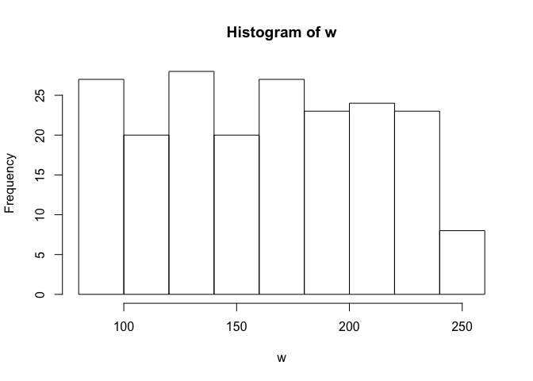
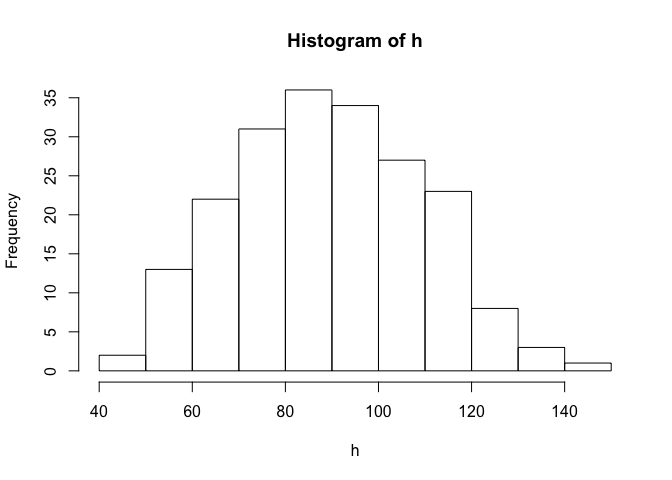
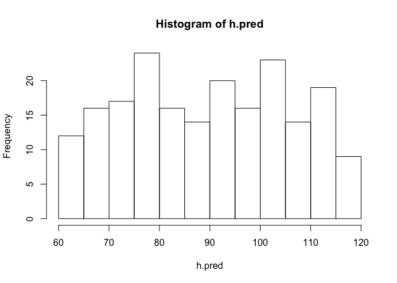
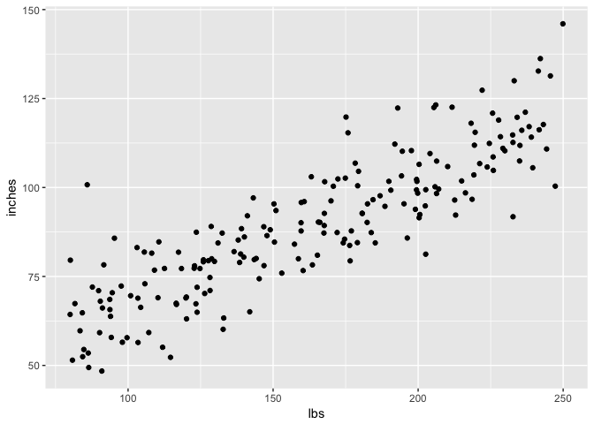
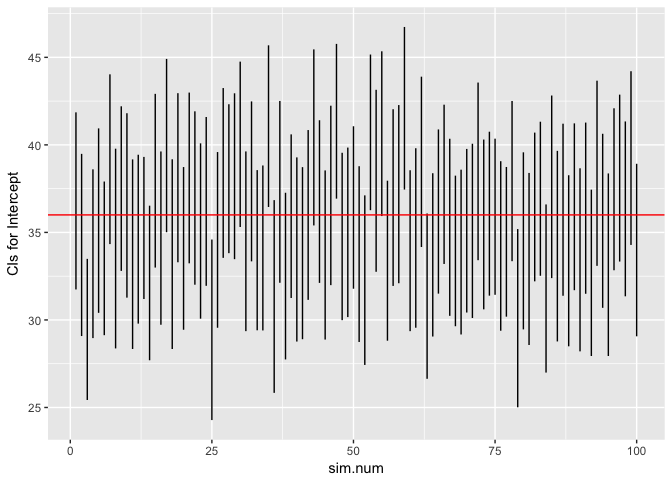
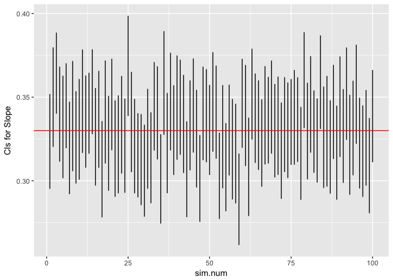
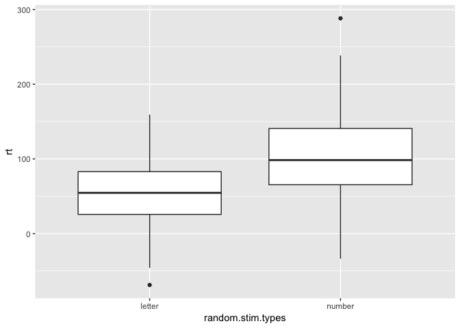
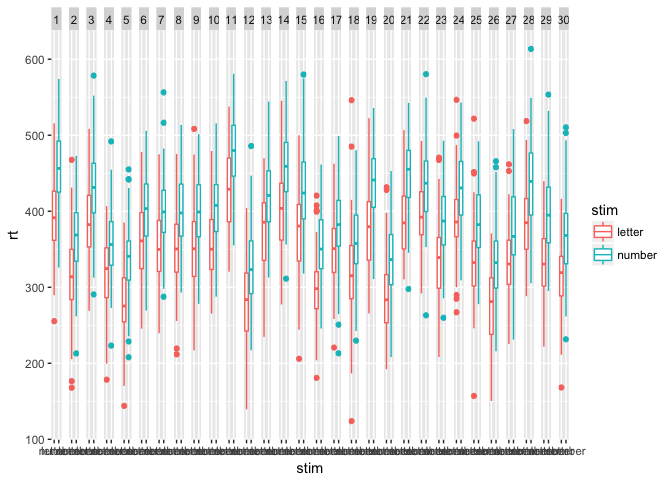

# 2017-02-13-sim-vis-templates
Rick O. Gilmore  
`r Sys.Date()`  
<!-- Simulation and visualization assigment template -->


## Assignment (due Monday, Feburary 20)

- Create your own simulated data set for a real or proposed study.
    + You may adapt or build upon the examples used in class.
- Plot the results of your simulation using ggplot2 commands.
- The components below are drawn from today's slides. Feel free to use them as the basis of your work.

## Super-simple example

- Hypothesis 1: Height (inches) is correlated with weight (lbs)


```r
# choose sample size
sample.n <- 200

# choose intercept and slope
beta0 <- 36   # inches
beta1 <- 0.33  # Rick's guess

# choose standard deviation for error
sigma <- 10 # Rick's guess
```

---


```r
# random weights between 80 lbs and 250 lbs (uniform sampling)
w <- runif(n = sample.n, min = 80, max = 250)

h.pred <- rep(x = beta0, n = sample.n) + beta1 * w

# add random (normal) error
h <- h.pred + rnorm(n = sample.n, mean = 0, sd = sigma)
```

<!-- Code to make scrolling slides -->
<style>
slides > slide { overflow: scroll; }
slides > slide:not(.nobackground):before {
  background: none;
  }
slides > slide:not(.nobackground):after {
  content: '';
  background: none;
  }
}
</style>
---


```r
library(ggplot2)
library(dplyr)
```

```
## 
## Attaching package: 'dplyr'
```

```
## The following objects are masked from 'package:stats':
## 
##     filter, lag
```

```
## The following objects are masked from 'package:base':
## 
##     intersect, setdiff, setequal, union
```

```r
hist(w)
```

<!-- -->

```r
hist(h)
```

<!-- -->

```r
hist(h.pred)
```

<!-- -->

---


```r
# Put h and w into data frame for ggplot
height.weight <- data.frame(inches = h, lbs = w)

# Plot
scatter.1 <- ggplot(data = height.weight) +
  aes(x = lbs, y = inches) +
  geom_point()
scatter.1
```

<!-- -->

## That's synthesis, now analysis

- Remember Hypothesis 1: Height (inches) is correlated with weight (lbs)?


```r
# Could use the raw data
# cor.test(x = w, y = h)
# Or, to use the values in the data frame, use with(...)

with(height.weight, cor.test(x = inches, y = lbs))
```

```
## 
## 	Pearson's product-moment correlation
## 
## data:  inches and lbs
## t = 24.567, df = 198, p-value < 2.2e-16
## alternative hypothesis: true correlation is not equal to 0
## 95 percent confidence interval:
##  0.8287820 0.8983336
## sample estimates:
##       cor 
## 0.8677445
```

## Aside: extracting the statistics to make an interactive report


```r
# Save output as a variable
cor.test.inches.lbs <- with(height.weight, cor.test(x = inches, y = lbs))

# What sort of beast is this?
mode(cor.test.inches.lbs)
```

```
## [1] "list"
```

---


```r
# Aha, it's a list, this shows me all of the parts
unlist(cor.test.inches.lbs)
```

```
##                            statistic.t 
##                     "24.5673793950949" 
##                           parameter.df 
##                                  "198" 
##                                p.value 
##                 "4.94710961386734e-62" 
##                           estimate.cor 
##                    "0.867744486117421" 
##                 null.value.correlation 
##                                    "0" 
##                            alternative 
##                            "two.sided" 
##                                 method 
## "Pearson's product-moment correlation" 
##                              data.name 
##                       "inches and lbs" 
##                              conf.int1 
##                    "0.828781985265993" 
##                              conf.int2 
##                    "0.898333552061122"
```

```r
# Looks like the t value is the first element
cor.test.inches.lbs[[1]]
```

```
##        t 
## 24.56738
```

---

The Pearson's product-moment correlation correlation between height and weight is 0.868, $t$(198)=24.567, $p$=0.00000, with a 95$\%$ confidence interval of [0.829, 0.898].

<span class="blue">I did some formatting to make the numbers look pretty.</span>

`sprintf("%.3f", my.var)` limits `my.var` to 3 decimal places; where `sprintf("%2.3f", my.var)` limits it to 2 digits to the left and 3 to the right.

## Now back to analysis with our synthetic data


```r
fit <- lm(formula = inches ~ lbs, data = height.weight)
summary(fit) # Use lm() command to fit formula
```

```
## 
## Call:
## lm(formula = inches ~ lbs, data = height.weight)
## 
## Residuals:
##     Min      1Q  Median      3Q     Max 
## -22.240  -6.586  -0.323   5.737  37.929 
## 
## Coefficients:
##             Estimate Std. Error t value Pr(>|t|)    
## (Intercept) 32.90333    2.40755   13.67   <2e-16 ***
## lbs          0.34840    0.01418   24.57   <2e-16 ***
## ---
## Signif. codes:  0 '***' 0.001 '**' 0.01 '*' 0.05 '.' 0.1 ' ' 1
## 
## Residual standard error: 9.785 on 198 degrees of freedom
## Multiple R-squared:  0.753,	Adjusted R-squared:  0.7517 
## F-statistic: 603.6 on 1 and 198 DF,  p-value: < 2.2e-16
```

```r
(ci <- confint(fit)) # confint() command fits confidence intervals
```

```
##                  2.5 %     97.5 %
## (Intercept) 28.1556066 37.6510505
## lbs          0.3204354  0.3763676
```

Surrounding `(ci <- confint(fit))` in parentheses saves variable ci and prints it out.

## How'd we do?

| Parameter | Actual    | Low Estimate | High Estimate |
|-----------|-----------|--------------|---------------|
| $\beta0$  | 36 | 28.1556066  | 37.6510505   |
| $\beta1$  | 0.33 | 0.3204354  | 0.3763676   |

- Why off on the slope ($\beta1$)
- Random error, probably. Could run again.

---


```
## 
## Call:
## lm(formula = inches ~ lbs, data = height.weight)
## 
## Residuals:
##      Min       1Q   Median       3Q      Max 
## -24.0637  -7.0381   0.0217   6.7354  26.1466 
## 
## Coefficients:
##             Estimate Std. Error t value Pr(>|t|)    
## (Intercept) 41.04269    2.60514   15.76   <2e-16 ***
## lbs          0.30204    0.01517   19.91   <2e-16 ***
## ---
## Signif. codes:  0 '***' 0.001 '**' 0.01 '*' 0.05 '.' 0.1 ' ' 1
## 
## Residual standard error: 10.17 on 198 degrees of freedom
## Multiple R-squared:  0.6668,	Adjusted R-squared:  0.6651 
## F-statistic: 396.3 on 1 and 198 DF,  p-value: < 2.2e-16
```

```
##                  2.5 %     97.5 %
## (Intercept) 35.9053102 46.1800724
## lbs          0.2721223  0.3319649
```

---

| Parameter | Actual    | Low Estimate | High Estimate |
|-----------|-----------|--------------|---------------|
| $\beta0$  | 36 | 35.9053102  | 46.1800724   |
| $\beta1$  | 0.33 | 0.2721223  | 0.3319649   |

## Let's make it a function

- Functions help automate routines
- Parts of a function:
    + Input parameters
        - Defaults or not
    + Output(s)
- `My.function.name <- function(my.param1, my.param2 = "cool")`

----


```r
# define global constants from prior simulation
sample.n = 200
beta0 = 36
beta1 = .33
sigma = 10
min.x = 80
max.x = 250
```

<!-- Code to make slides that overflow scroll. -->
<!-- http://stackoverflow.com/q/38260799 -->
<style>
slides > slide { overflow: scroll; }
slides > slide:not(.nobackground):before {
  background: none;
  }
slides > slide:not(.nobackground):after {
  content: '';
  background: none;
  }
}
</style>

---


```r
Height.weight.sim <- function(sample.n = 200, beta0 = 36, beta1 = .33, sigma = 10, min.x = 80, max.x = 250) {
  # Calculates correlation, intercept, slope estimates for
  # linear relation between two variables
  
  # Args:
  #   sample.n: Number of sample poings, default is 200
  #   beta0: Intercept, default is 36 (inches)
  #   beta1: Slope, default is .33
  #   sigma: Standard deviation of error
  #   min.x: Minimum value for x (weight in lbs)
  #   max.x: Maximum value for x (weight in lbs)
  #
  # Returns:
  #   Named array with values
  #   beta0
  #   beta1
  #   beta0.lo: 2.5% quantile for intercept
  #   beta0.hi  97.5% quantile for intercept
  #   beta1.lo  2.5% quantile for slope
  #   beta1.hi  97.5% quantile for slope

  w <- runif(n = sample.n, min = min.x, max = max.x)

  h.pred <- rep(x = beta0, n = sample.n) + beta1 * w
  h <- h.pred + rnorm(n = sample.n, mean = 0, sd = sigma)
  height.weight <- data.frame(inches = h, lbs = w)

  fit <- lm(formula = inches ~ lbs, data = height.weight)
  ci <- confint(fit)
  
  # Create output vector with named values
  (results <- c("beta0" = beta0, 
    "beta1"= beta1, 
    "beta0.lo" = ci[1,1],
    "beta0.hi" = ci[1,2],
    "beta1.lo" = ci[2,1],
    "beta1.hi" = ci[2,2]))
}
```

---


```r
# Defaults only
Height.weight.sim()
```

```
##      beta0      beta1   beta0.lo   beta0.hi   beta1.lo   beta1.hi 
## 36.0000000  0.3300000 34.8838799 44.5121120  0.2831546  0.3376237
```

```r
# Larger sample size
Height.weight.sim(sample.n = 500)
```

```
##      beta0      beta1   beta0.lo   beta0.hi   beta1.lo   beta1.hi 
## 36.0000000  0.3300000 32.8458604 39.1194873  0.3092460  0.3461694
```

## Doing a series of simulations

- Goal: run our function a number of times, collect the results


```r
n.simulations = 100
n.vars = 6 # variables Height.weight.sim() outputs

# initialize output array
height.weight.sim.data <- array(0, dim=c(n.simulations, n.vars))

# Repeat Height.weight.sim() n.simulations times
for (i in 1:n.simulations) { 
  height.weight.sim.data[i,] <- Height.weight.sim()
  }
```

---


```r
# Easier to make simulation data a data frame
ht.wt.sims <- as.data.frame(sim.num = 1:n.simulations, height.weight.sim.data)

# Add a variable to index the simulation number
ht.wt.sims$sim.num <- 1:n.simulations

# Plot beta0 min and max (now called V3, V4)
ggplot(data = ht.wt.sims) +
  aes(x = sim.num) +
  geom_linerange(mapping = aes(ymin=V3,
                                ymax=V4)) +
  ylab("CIs for Intercept") +
  geom_hline(yintercept = beta0, color = "red")
```

<!-- -->

---


```r
# Plot beta1 min and max (now called V5, V6)
ggplot(data = ht.wt.sims) +
  aes(x = sim.num) +
  geom_linerange(mapping = aes(ymin=V5,
                                ymax=V6)) +
  ylab("CIs for Slope") +
  geom_hline(yintercept = beta1, color = "red")
```

<!-- -->

## How about a factorial design?

- Dependent variable: RT
- Independent variables
    + Fixed
        - Symbol type: {letter, number}
    + Random
        - Subject mean RT
- Hypothesis:
    + RT to detect numbers is lower than for letters
    + There is no order effect
- Rick wishes he'd found this first: <https://www.r-bloggers.com/design-of-experiments-%E2%80%93-full-factorial-designs/>

---

```r
# Simulation parameters
n.subs = 30
trials.per.cond = 100

letters.numbers.rt.diff = 50 # ms
rt.mean.across.subs = 35
sigma = 50
cond.labels = c("letter", "number")
cond.rts <- c("letter" = 0, "number" = letters.numbers.rt.diff)

stim.types <- factor(x = rep(x = c(1,2), trials.per.cond), labels = cond.labels)

#sample(factor(x=rep(c("letter", "number"), 100)), 200)
random.stim.types <- sample(stim.types, trials.per.cond*length(cond.labels))

mean.sub.rt <- rnorm(n = 1, mean = rt.mean.across.subs, sd = sigma)
trial.rt <- array(0, dim = length(random.stim.types))

# Generate RTs based on trial, condition
for (t in 1:length(random.stim.types)) {
  trial.rt[t] <- mean.sub.rt + cond.rts[random.stim.types[t]] + rnorm(n = 1, mean = 0, sd = sigma)
}

# Make data frame
letter.number.df <- data.frame(trial = 1:length(random.stim.types), stim = random.stim.types, rt = trial.rt)

ggplot(data = letter.number.df, aes(x = random.stim.types, y = rt)) + geom_boxplot()
```

<!-- -->

## Put this in a function


```r
Simulate.sub.rt <- function(trials.per.cond = 100,
                            letters.numbers.rt.diff = 50,
                            rt.mean.across.subs = 350, 
                            sigma = 50) {
  
  cond.rts <- c("letter" = 0, "number" = letters.numbers.rt.diff)
  stim.types <- factor(x = rep(x = c(1,2), trials.per.cond), labels = c("letter", "number"))
  random.stim.types <- sample(stim.types, 200)

  mean.sub.rt <- rnorm(n = 1, mean = rt.mean.across.subs, sd = sigma)
  trial.rt <- array(0, dim = length(random.stim.types))

  # Generate RTs based on trial, condition
  for (t in 1:length(random.stim.types)) {
    trial.rt[t] <- mean.sub.rt + cond.rts[random.stim.types[t]] +
      rnorm(n = 1, mean = 0, sd = sigma)
    }

  # Make data frame
  letter.number.df <- data.frame(trial = 1:length(random.stim.types), 
                                 stim = random.stim.types, 
                                 rt = trial.rt)
}
```

## Create code to a set of participants and create one merged data frame


```r
Make.sub.rt.df <- function(sub.id) {
  sub.rt.df <- Simulate.sub.rt()
  sub.rt.df$sub.id <- sub.id
  sub.rt.df
}

# Use lapply to make separate data frames for all subs
sub.rt.df.list <- lapply(1:n.subs, Make.sub.rt.df)

# Use Reduce() with the merge function to make one big file
sub.rt.df.merged <- Reduce(function(x, y) merge(x, y, all=TRUE), sub.rt.df.list)
```

## Now, want to see what we have?


```r
ggplot(data = sub.rt.df.merged) +
  aes(x=stim, y=rt, color=stim) +
  geom_boxplot() +
  facet_grid(facets = . ~ as.factor(sub.id))
```

<!-- -->

## And, just for fun


```r
library(lme4)
```

```
## Loading required package: Matrix
```

```r
fit1 <- lmer(formula = rt ~ stim + (1|sub.id), data = sub.rt.df.merged)
summary(fit1)
```

```
## Linear mixed model fit by REML ['lmerMod']
## Formula: rt ~ stim + (1 | sub.id)
##    Data: sub.rt.df.merged
## 
## REML criterion at convergence: 64048.7
## 
## Scaled residuals: 
##     Min      1Q  Median      3Q     Max 
## -3.8352 -0.6789  0.0045  0.6695  4.6488 
## 
## Random effects:
##  Groups   Name        Variance Std.Dev.
##  sub.id   (Intercept) 1604     40.05   
##  Residual             2476     49.76   
## Number of obs: 6000, groups:  sub.id, 30
## 
## Fixed effects:
##             Estimate Std. Error t value
## (Intercept)  347.990      7.368   47.23
## stimnumber    49.534      1.285   38.56
## 
## Correlation of Fixed Effects:
##            (Intr)
## stimnumber -0.087
```

## Or


```r
fit2 <- aov(formula = rt ~ stim + Error(as.factor(sub.id)), data = sub.rt.df.merged)
summary(fit2)
```

```
## 
## Error: as.factor(sub.id)
##           Df  Sum Sq Mean Sq F value Pr(>F)
## Residuals 29 9374092  323245               
## 
## Error: Within
##             Df   Sum Sq Mean Sq F value Pr(>F)    
## stim         1  3680373 3680373    1487 <2e-16 ***
## Residuals 5969 14776912    2476                   
## ---
## Signif. codes:  0 '***' 0.001 '**' 0.01 '*' 0.05 '.' 0.1 ' ' 1
```


